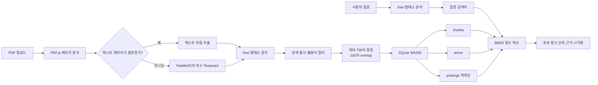

# OCR BM25 Browser Demo

PDF를 브라우저에 올리면 텍스트 추출/OCR부터 한국어 형태소 분석, 청킹, SQLite 역색인 생성, BM25 검색 점수 계산까지 전 과정을 로컬에서 실행하고 시각화하는 학습용 데모입니다.

이 프로젝트는 질문에 대한 자연어 답변을 생성하지 않습니다. 대신 질문의 어떤 형태소가 어떤 청크와 일치했고, TF·DF·IDF·문서 길이 보정이 최종 순위에 얼마나 기여했는지를 보여줍니다.

## 핵심 특징

- PDF와 문서 내용은 외부 OCR/API 서버로 전송하지 않습니다.
- 텍스트 PDF는 PDF.js로 직접 추출하고, 텍스트 레이어가 부족한 페이지만 OCR합니다.
- PaddleOCR 한국어 전용 모델과 Tesseract.js를 선택해 비교할 수 있습니다.
- Kiwi WASM으로 한국어 형태소를 분석하고 검색에 사용할 품사만 남깁니다.
- SQLite WASM에 청크와 sparse 역색인을 만들고 브라우저 메모리에서 BM25를 계산합니다.
- 질문 형태소, 일치/불일치 검색어, 청크 순위, 점수 산식과 SQLite 실제 행을 UI에서 확인할 수 있습니다.

## 처리 Workflow



### 1. PDF 판별과 텍스트 추출

PDF.js가 각 페이지의 텍스트 레이어를 먼저 읽습니다. 공백을 제외한 텍스트가 40자 이상이면 직접 추출하고, 그보다 적으면 이미지 기반 페이지로 판단해 OCR 대상으로 보냅니다.

`모든 페이지 OCR`을 켜면 텍스트 레이어 유무와 관계없이 OCR 엔진의 성능과 추출 품질을 시험할 수 있습니다.

### 2. OCR

두 엔진을 UI에서 선택할 수 있습니다.

#### PaddleOCR

- 탐지: `PP-OCRv5_mobile_det`
- 인식: `korean_PP-OCRv5_mobile_rec`
- 실행: ONNX Runtime Web + WASM
- 인식 대상: 한국어, 영어, 숫자
- 페이지에서 글자 영역을 탐지한 뒤 각 영역을 한국어 모델로 인식합니다.
- 현재 Vinext가 공식 SDK Worker 번들을 다시 묶을 때 발생하는 호환 문제를 피하기 위해 브라우저 메인 스레드, 단일 WASM 스레드로 실행합니다.

#### Tesseract.js

- 언어: `kor` + `eng`
- 엔진: LSTM only
- 기본 페이지 분할: `PSM.AUTO`
- 신뢰도 62 미만 또는 유효 문자가 100자 미만이면 문서 여백 제거, 회색조·대비 보정 후 `PSM.SPARSE_TEXT`로 한 번 재처리합니다.

### 3. Kiwi 한국어 형태소 분석

Kiwi는 별도 Web Worker에서 WASM으로 실행합니다. 명사, 용언, 어근, 부사, 외국어, 한자, 숫자처럼 검색에 의미가 있는 품사를 남기고 검색에 영향이 적은 일부 고빈도 어휘를 제거합니다.

현재 불용어 예시는 `하`, `되`, `있`, `없`, `것`, `수`, `때` 등입니다. 원문을 먼저 삭제하는 방식이 아니라 형태소 분석 후 검색어 목록에서 제외하므로 페이지 원문과 청크 내용은 보존됩니다.

### 4. 청킹

- 최대 길이: 700자
- 겹침: 100자
- 우선 경계: 줄바꿈, 마침표, `다.` 종결
- 앞 청크의 끝부분을 다음 청크에 겹쳐 문맥이 경계에서 끊기는 문제를 줄입니다.

### 5. SQLite WASM과 sparse 역색인

SQLite 데이터베이스는 서버 파일이 아니라 브라우저 메모리에 생성됩니다. 현재 구현은 IndexedDB에 DB를 영구 저장하지 않으므로 새로고침하면 사라집니다.

```sql
CREATE TABLE chunks (
  id INTEGER PRIMARY KEY,
  page INTEGER NOT NULL,
  source TEXT NOT NULL,
  content TEXT NOT NULL,
  token_count INTEGER NOT NULL
);

CREATE TABLE terms (
  term TEXT PRIMARY KEY,
  df INTEGER NOT NULL
);

CREATE TABLE postings (
  term TEXT NOT NULL,
  chunk_id INTEGER NOT NULL,
  tf INTEGER NOT NULL,
  PRIMARY KEY (term, chunk_id)
);
```

- `chunks`: 페이지 번호, 추출 방식, 청크 원문, 검색 토큰 수
- `terms`: 고유 형태소와 해당 형태소가 등장한 청크 수(DF)
- `postings`: 형태소가 실제로 등장한 청크와 청크 내부 빈도(TF)

BM25 벡터의 모든 0 값을 저장하지 않습니다. 예를 들어 `처분`이 3번 등장한 청크만 `(처분, chunk_id, 3)` 형태로 기록합니다. 이것이 이 데모에서 말하는 sparse 역색인입니다.

## 질문과 BM25 점수

BM25는 임베딩 모델이나 의미 벡터를 사용하지 않습니다. 질문도 Kiwi로 분석한 뒤 문서와 동일한 규칙으로 검색 형태소 목록을 만듭니다. 각 질문 형태소에 대해 `postings`를 조회하고 아래 점수를 더합니다.

```text
IDF(t) = ln(1 + (N - DF(t) + 0.5) / (DF(t) + 0.5))

score(t, d) = IDF(t) ×
              TF(t,d) × (k1 + 1)
              ───────────────────────────────────────────
              TF(t,d) + k1 × (1 - b + b × |d| / avgdl)

k1 = 1.2, b = 0.75
```

- `N`: 전체 청크 수
- `DF(t)`: 형태소 `t`가 등장한 청크 수
- `TF(t,d)`: 청크 `d`에서 형태소 `t`가 등장한 횟수
- `|d|`: 청크의 검색 토큰 수
- `avgdl`: 전체 청크의 평균 검색 토큰 수

여러 청크에 흔한 형태소는 IDF가 낮아지고, 특정 청크에 집중된 형태소는 더 크게 기여합니다. 긴 청크가 단순히 단어를 많이 포함해 유리해지지 않도록 문서 길이도 보정합니다. UI의 `상대 점수`는 최고 BM25 점수를 100으로 환산한 비교값이며 확률이나 정확도 퍼센트가 아닙니다.

## WASM과 모델 파일

대형 모델과 생성형 정적 자산은 Git 저장소에 포함하지 않습니다. `npm run assets:prepare`가 공식 배포처에서 모델을 내려받고, npm 패키지에 포함된 WASM과 런타임을 `public` 아래에 배치합니다.

아래 크기는 준비 명령 실행 후 로컬에 만들어지는 파일을 기준으로 한 대략적인 값입니다.

| 구성 | 역할 | 크기 | 저장 위치 |
| --- | --- | ---: | --- |
| PaddleOCR detection | 글자 영역 탐지 | 4.6 MiB | `public/vendor/paddleocr/PP-OCRv5_mobile_det_onnx_infer.tar` |
| PaddleOCR Korean recognition | 한국어·영어·숫자 인식 | 12.9 MiB | `public/vendor/paddleocr/korean_PP-OCRv5_mobile_rec_onnx_infer.tar` |
| ONNX Runtime JSEP WASM | PaddleOCR 추론 | 26.5 MiB | `node_modules`에서 빌드 자산으로 생성 |
| Kiwi WASM | 한국어 형태소 분석 런타임 | 3.6 MiB | `public/kiwi/kiwi-wasm.wasm` |
| Kiwi active models | 형태소 사전·통계 모델 | 약 89.5 MiB | `public/kiwi/model/` |
| SQLite WASM | 인메모리 DB·SQL 실행 | 643 KiB | `public/vendor/sql-wasm.wasm` |
| Tesseract core | OCR 런타임 변형 3종 | 약 8.2 MiB | `public/vendor/tesseract/` |
| Tesseract language data | 한국어·영어 학습 데이터 | 약 17 MiB | `public/vendor/tessdata/` |

`node_modules/onnxruntime-web` 전체 설치 크기는 여러 backend와 개발용 파일을 포함해 약 136 MiB이지만, 브라우저가 전부 내려받는 것은 아닙니다. 현재 PaddleOCR 실행에는 선택된 JSEP WASM과 모듈, OCR 모델, SDK/OpenCV 청크만 사용됩니다.

모델은 앱의 정적 파일로 제공되며 문서가 모델 서버로 전송되는 구조가 아닙니다. 브라우저 HTTP 캐시가 모델 다운로드를 재사용할 수 있지만, OCR 세션과 SQLite DB는 페이지를 다시 열 때 새로 초기화됩니다.

### 모델 출처와 준비 방식

- PaddleOCR 탐지 모델: PaddleOCR 공식 모델 저장소의 `PP-OCRv5_mobile_det` ONNX 배포본
- PaddleOCR 한국어 인식 모델: [PaddlePaddle/korean_PP-OCRv5_mobile_rec_onnx](https://huggingface.co/PaddlePaddle/korean_PP-OCRv5_mobile_rec_onnx)의 고정 리비전
- Kiwi CoNg 모델: [Kiwi v0.23.0 release](https://github.com/bab2min/Kiwi/releases/tag/v0.23.0)의 `cong-base` 모델
- Kiwi/Tesseract/PDF.js/SQLite WASM: `package-lock.json`으로 고정된 npm 패키지에서 복사

다운로드된 모델은 `.gitignore` 대상입니다. PDF 원문과 실행 중 생성되는 SQLite DB도 저장소에 들어가지 않습니다.

## 실행 방법

### 요구사항

- Node.js 22.13 이상
- 최신 Chromium 계열 브라우저 권장

### 설치 및 자산 준비

```bash
npm ci
npm run assets:prepare
```

`assets:prepare`는 macOS/Linux의 `bash`, `curl`, `tar`를 사용합니다. 이미 준비된 대형 모델은 다시 내려받지 않으며, npm 패키지에서 가져오는 런타임 파일은 버전에 맞춰 다시 복사합니다.

### 개발 서버

```bash
npm run dev
```

브라우저에서 `http://localhost:5173`을 엽니다.

### 검증

```bash
npm run check:bm25
npm run build
```

처음 클론한 뒤 한 번에 빌드하려면 다음 명령을 사용합니다.

```bash
npm ci && npm run assets:prepare && npm run build
```

## 화면에서 확인할 수 있는 것

1. 단계별 PDF 판별/OCR/Kiwi/청킹/SQLite 소요 시간
2. 페이지별 TEXT/OCR 판별, OCR 엔진, 신뢰도와 인식 시간
3. 질문의 전체 형태소와 실제 검색에 사용된 형태소
4. 후보 청크의 BM25 원점수와 최고점 대비 상대 점수
5. 형태소별 TF, DF, IDF, 길이 보정 분모, 기여 점수
6. SQLite의 `chunks`, `terms`, `postings` 실제 데이터

## 주요 코드

```text
app/page.tsx          PDF/OCR 파이프라인과 UI
app/kiwi.worker.ts    Kiwi WASM Web Worker
lib/bm25.ts           청킹, 형태소 필터, SQLite 역색인, BM25
scripts/check-bm25.ts BM25 계산 검증
scripts/prepare-assets.sh 모델 다운로드와 WASM/런타임 배치
public/kiwi/          준비 명령이 생성하는 Kiwi WASM·모델(커밋 제외)
public/vendor/        준비 명령이 생성하는 OCR·PDF.js·SQLite 자산(커밋 제외)
```

## 현재 제약

- PaddleOCR는 현재 메인 스레드에서 실행되므로 큰 페이지를 처리하는 동안 UI 반응이 느려질 수 있습니다.
- 텍스트 레이어가 있는 PDF는 기본적으로 OCR하지 않습니다. OCR 비교가 목적이면 `모든 페이지 OCR`을 켜야 합니다.
- SQLite DB는 메모리 전용이며 새로고침 후 복구되지 않습니다.
- BM25는 동일하거나 유사한 표면 형태소의 일치를 계산합니다. 동의어·문맥 의미를 자동으로 이해하는 임베딩 검색은 포함하지 않습니다.
- OCR 신뢰도는 OCR 엔진의 추정치이고 BM25 상대 점수는 검색 결과 내부 비교값입니다. 둘 다 정답 확률이 아닙니다.

## 주요 오픈소스와 라이선스

| 프로젝트 | 용도 | 라이선스 |
| --- | --- | --- |
| PaddleOCR.js | PaddleOCR 브라우저 파이프라인 | Apache-2.0 |
| ONNX Runtime Web | ONNX 모델 추론 | MIT |
| OpenCV.js | 이미지 전·후처리 | Apache-2.0 |
| Tesseract.js | 비교용 OCR | Apache-2.0 |
| Kiwi NLP | 한국어 형태소 분석 | LGPL-2.1-or-later |
| sql.js | SQLite WASM | MIT |
| PDF.js | PDF 읽기와 렌더링 | Apache-2.0 |

각 모델과 라이브러리를 재배포할 때는 해당 프로젝트와 모델 파일의 라이선스 및 고지 조건을 별도로 확인하세요.
